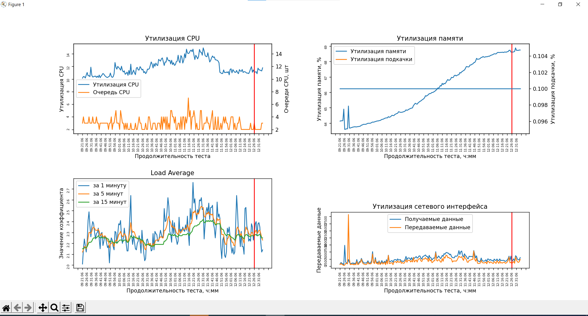

# PythonGraphs 
PythonGraphs is an application written on python. The main goal of this app is to create graphs using sar log file. 
The default file is sar_mpgu_izh.csv.

First of all to use it you need to install some packages using pip

```bash
pip install matplotlib
pip install pandas
pip install numpy
```

## Graphs
This app creates 4 graphs using logs: CPU usage, Network usage, Load Average and Memory usage

Example:
